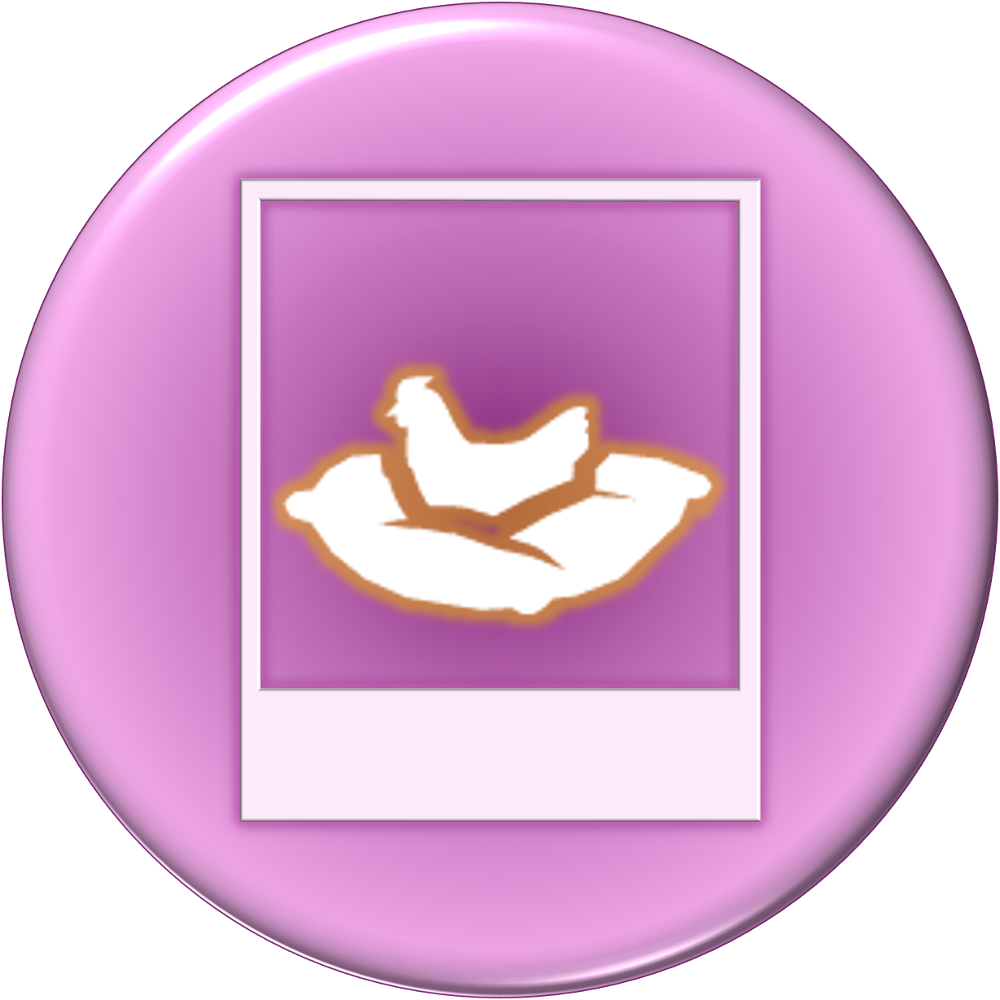

# Ferani's Icarus Modding Research

  

Welcome to my research data on the game Icarus, that I've gathered and worked on for months while making mods for the game.

For a vast majority of the more advanced mods, I have used a custom plugin with the Codex AI-assistant that has been trained in handling and editing .uassets, game mechanics and quality control. For simpler mods I have done the work myself, and Codex has helped with the documentation. I wanted to share some of the notes and lessons learned with other modders, so we may get a deeper understanding of the game and how to mod it effectively and make it more fun!

You may freely apply the lessons and run the tools for your own projects or use this research as context for your own assistant. Linking to this repository is welcome. Please ask before republishing repository files or publicly distributing modified copies, and always credit Ferani when sharing findings based on this work. See [Usage Permissions](LICENSE.md) for examples.

And now to the research:

Practical notes, tested workflows, reusable tools, and case studies for modding *Icarus: First Cohort*.

This project records what we have learned while building and testing mods. It is organized around the question a modder is trying to answer, rather than around the order in which the experiments happened.

## Start Here

- [Research library](docs/README.md)
- [Practical recipes](docs/recipes/README.md)
- [Research catalog](docs/research-catalog.md)
- [Evidence and confidence labels](docs/evidence-and-confidence.md)
- [Reusable tools](tools/README.md)
- [Mod showcase](showcase/README.md)
- [Sources and attribution](sources/README.md)
- [Contributing](CONTRIBUTING.md)
- [Usage permissions](LICENSE.md)
- [Publication roadmap](ROADMAP.md)

## Library Map

| Shelf | What belongs there |
| --- | --- |
| [Mechanics](docs/mechanics/) | How game systems connect: buildings, deployables, processors, inventory, animals, combat, environment, and UI. |
| [Practical recipes](docs/recipes/) | Friendly, repeatable instructions for proven mod transformations. |
| [Workflows](docs/workflows/) | Repeatable procedures for DataTables, cooked assets, testing, packaging, and DLC safety. |
| [Case studies](docs/case-studies/) | Experiments that produced durable lessons, including failures and recovery paths. |
| [Tools](tools/) | PowerShell helpers for indexing local exports, searching Data.pak, tracking updates, and auditing DLC gates. |
| [Showcase](showcase/) | Finished or playtest-ready projects and the research they demonstrate. |
| [Sources](sources/) | Community projects, official references, attribution, and redistribution boundaries. |

## Evidence Labels

- **Verified:** reproduced in game or confirmed by a direct asset read-back plus runtime test.
- **Observed:** directly seen in exported data, cooked asset metadata, logs, or UI behavior.
- **Inferred:** a strong explanation supported by several clues but not yet isolated in game.
- **Open question:** useful lead that still needs a decisive test.

These labels matter. Cooked Unreal assets reveal names, defaults, references, and function signatures, but they do not always reveal the complete Blueprint graph or native code path.

## Scope And Boundaries

This repository contains original notes and original helper scripts. It does not distribute extracted game packages, bulk cooked assets, game binaries, private logs, account data, or third-party material without permission.

This is an unofficial community research project and is not affiliated with or endorsed by RocketWerkz. *Icarus* and its game content belong to their respective rights holders.

Finished Ferani Shades mods remain in the separate [Icarus_Mods repository](https://github.com/FeraniShades/Icarus_Mods). Community building-system research by BushCoda is linked and credited in [sources](sources/README.md); that project remains separately owned.

## Project Status

The first public edition is live. The library will continue to grow as experiments produce verified rules, practical recipes, and useful dead ends. GitHub Pages remains optional while the Markdown structure settles.
